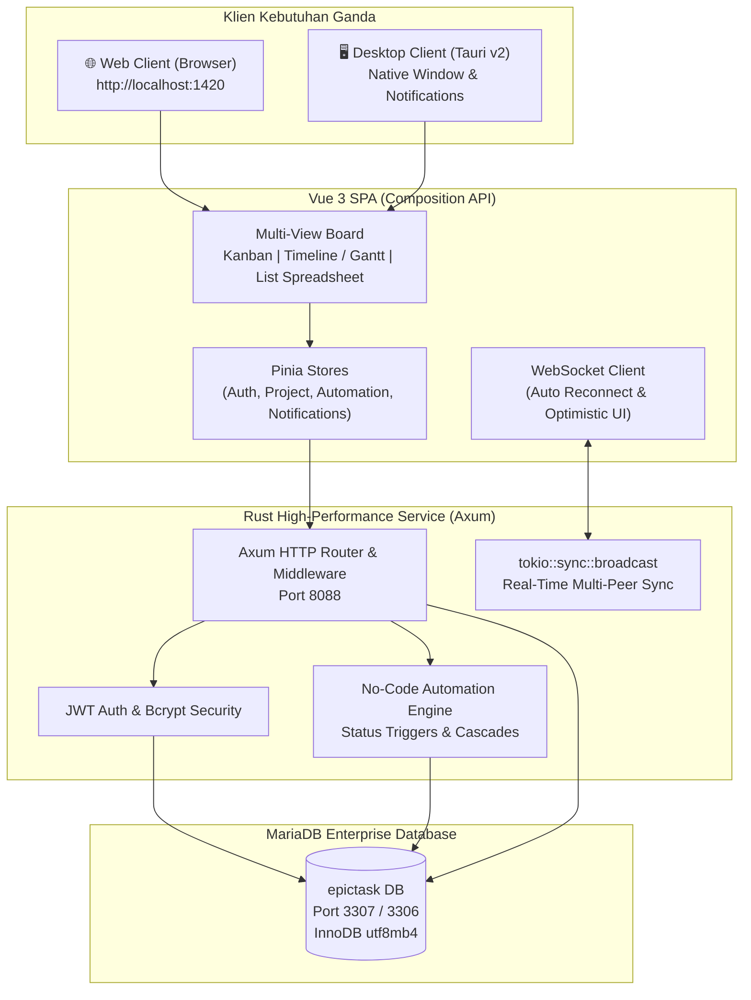

# EpicTask — High-Performance Modern Project & Issue Tracking Platform

[](https://vuejs.org/)
[](https://www.rust-lang.org/)
[](https://mariadb.org/)
[](https://tauri.app/)

**EpicTask** adalah platform manajemen proyek dan pelacakan isu modern berkecepatan tinggi yang dirancang untuk tim rekayasa perangkat lunak modern. EpicTask menyediakan fungsionalitas esensial pelacakan kerja (Hierarki Isu, Custom Workflows, Multi-View Board, dan No-Code Automation) dengan UI/UX yang jauh lebih cepat, responsif, dan fleksibel baik untuk Web Application maupun Native Cross-Platform Desktop App (Linux, macOS, Windows via Tauri).

---

## 🏛️ Arsitektur Sistem

EpicTask menggunakan pola **Hybrid Architecture**: backend Rust Axum menyajikan RESTful API dan WebSocket server, melayani frontend Vue 3 baik pada browser biasa maupun di dalam window native Tauri Desktop.



---

## 🚀 Fitur Unggulan (Berdasarkan PRD)

### 1. EPIC 1: User, Workspace & Role Management
* **JWT Authentication:** Registrasi, Login, dan Logout menggunakan JWT bearer tokens dan hashing password aman menggunakan `bcrypt`.
* **Multi-Workspace:** Satu akun dapat memiliki dan beralih di antara beberapa workspace terpisah.
* **Role-Based Access Control (RBAC):** Peran terstruktur tingkat Workspace: `OWNER`, `ADMIN`, `MEMBER`, dan `VIEWER`.

### 2. EPIC 2: Project & Board Management (Multi-View)
* **Kanban View:** Kolom status dinamis dengan Drag-and-Drop native beranimasi mulus, indikator WIP (Work-in-Progress), dan drop indicator.
* **Timeline / Gantt View:** Visualisasi diagram batang horizontal interaktif yang memplot tanggal mulai (*Start Date*) dan tenggat (*Due Date*), navigasi minggu/hari, dan status milestone.
* **Spreadsheet List View:** Tampilan tabular spreadsheet berkecepatan tinggi dengan kemampuan inline-editing instan untuk Summary, Type, Status, Priority, Assignee, Points, dan Due Date tanpa perlu membuka dialog.
* **Custom Workflows & Transition Guards:**
  * Penambahan status/kolom dinamis (dengan kategori `TODO`, `IN_PROGRESS`, `DONE` dan custom color picker).
  * **Workflow Transition Rules:** Admin dapat mengunci alur perpindahan status (contoh: tiket di *Backlog* dilarang langsung digeser ke *Done* sebelum melewati *To Do* & *In Progress*). Sistem otomatis menolak perpindahan ilegal dengan pesan guard yang jelas.

### 3. EPIC 3: Issue/Task Lifecycle
* **Issue Hierarchy:** Dukungan tipe hierarkis lengkap: **Epic** (inisiatif besar), **Story / Task** (pekerjaan standar), dan **Subtask** (anak dari tiket utama).
* **Atomic Issue Key Generation:** Penomoran tiket (`EPIC-1`, `EPIC-2`, dst.) dibuat secara aman dari race condition menggunakan transaksi terisolasi `SELECT ... FOR UPDATE` pada MariaDB.
* **Metadata Lengkap:** Summary, Rich Description, Priority (Highest, High, Medium, Low), Story Points (Deret Fibonacci: 1, 2, 3, 5, 8, 13), Start Date, Due Date, Assignee, Reporter, dan Relasi Antar-Isu (*Blocks*, *Is Blocked By*, *Relates To*).

### 4. EPIC 4: Execution & Tracking
* **Time Tracking (Log Work):** Input konsumsi jam kerja nyata dengan riwayat catatan pekerjaan dan kalkulator total jam kerja.
* **Interactive Comments & @Mentions:** Kolom komentar interaktif dengan deteksi otomatis `@username` yang langsung memicu notifikasi internal ke pengguna terkait.
* **Subtask Checklist:** Progress bar interaktif yang otomatis menghitung persentase subtask berstatus `DONE` terhadap total subtask, dengan checkbox cepat untuk toggle status.

### 5. EPIC 5: No-Code Automation Engine
* **Visual Rule Builder (IF-THEN-THAT):** Antarmuka intuitif untuk menyusun otomasi tanpa menulis kode.
* **Core Triggers:**
  * *Status Changed:* Memicu aksi saat status berubah (misalnya menjadi `DONE`).
  * *Due Date Alert:* Pengecekan otomatis di background jika batas waktu tersisa < 24 jam.
* **Core Actions:**
  * *Cascade Subtasks:* Otomatis mengubah seluruh anak subtask menjadi `Done` ketika tiket induknya selesai.
  * *Reassign to Reporter:* Menugaskan kembali tiket ke pembuat aslinya saat pekerjaan rampung.
  * *Notify Assignee:* Mengirim notifikasi otomatis pengingat tenggat waktu.

### 6. EPIC 6: Real-time Collaboration & Notifications
* **WebSocket Synchronization:** Mutasi papan (geser kartu, edit, hapus, tambah komentar) langsung disiarkan instan ke seluruh klien yang terhubung melalui Axum WebSocket.
* **Activity Stream (Audit Log):** Pencatatan riwayat setiap aksi penting (pembuatan isu, pemindahan status, eksekusi otomatisasi, pencatatan waktu).
* **Notification Center:** Ikon lonceng di navbar dengan penghitung lencana *unread*, menu popover detail notifikasi, dan integrasi desktop native notification via Tauri API.

---

## 👥 Demo Accounts (Pre-Seeded)

Database telah dilengkapi dengan seed data komprehensif. Anda dapat langsung login menggunakan tombol **1-Click Quick Login** di antarmuka atau memasukkan kredensial berikut:

| Akun | Email | Password | Role |
|---|---|---|---|
| **Sarah Jenkins** (Tech Lead) | `sarah@epictask.dev` | `password123` | **OWNER** |
| **Alex Morgan** (Senior Fullstack) | `alex@epictask.dev` | `password123` | **MEMBER** |
| **Elena Rostova** (QA Specialist) | `elena@epictask.dev` | `password123` | **MEMBER** |
| **David Chen** (Product Owner) | `david@epictask.dev` | `password123` | **ADMIN** |

---

## 🛠️ Panduan Menjalankan Aplikasi

### 1. Prasyarat Sistem
* **Rust:** 1.80+ (`rustc`, `cargo`)
* **Node.js:** v18+ & `npm`
* **MariaDB:** Berjalan pada port `3307` (atau `3306`) dengan user `remot` / `PasW0rd123` atau sesuaikan pada `.env`.

### 2. Menjalankan Backend (Rust Axum)
```bash
# Masuk ke direktori backend
cd /home/lenovo/www/EpicTask/backend

# Jalankan server
cargo run
```
* Backend akan otomatis memverifikasi tabel database MariaDB dan menjalankan server pada:
  **`http://127.0.0.1:8088`**
* WebSocket endpoint:
  **`ws://127.0.0.1:8088/ws`**

### 3. Menjalankan Frontend (Vue 3 + Vite)
```bash
# Masuk ke direktori frontend
cd /home/lenovo/www/EpicTask/frontend

# Install dependencies (jika belum)
npm install

# Jalankan Vite dev server
npm run dev
```
* Antarmuka Web App dapat langsung diakses di browser pada:
  **`http://localhost:1420`**

### 4. Menjalankan Versi Desktop (Tauri v2)
```bash
cd /home/lenovo/www/EpicTask/frontend

# Menjalankan desktop app dalam mode development
npm run tauri dev

# Mengompilasi binary executable desktop (.deb, .appimage, atau binary native)
npm run tauri build
```

---

## 📁 Struktur Direktori Monorepo

```
EpicTask/
├── Cargo.toml                       # Root Cargo workspace (backend + frontend/src-tauri)
├── package.json                     # Monorepo scripts
├── EpicTask_PRD.md                  # PRD Spesifikasi Produk
├── README.md                        # Dokumentasi Lengkap Sistem
├── backend/                         # Rust Axum Backend
│   ├── Cargo.toml
│   ├── .env                         # Konfigurasi Database & Port (Port 8088)
│   └── src/
│       ├── main.rs                  # Entrypoint, DB pool, Background workers, Router
│       ├── config.rs                # Environment loader
│       ├── db.rs                    # Skema otomatis MariaDB
│       ├── routes.rs                # Definisi route REST & WebSocket
│       ├── auth/
│       │   ├── jwt.rs               # Pembuatan & validasi JWT token
│       │   └── middleware.rs        # Axum extractor untuk AuthUser
│       ├── models/                  # Struct model data (Issue, Status, User, Workflows)
│       ├── handlers/                # HTTP Controller handlers
│       │   ├── auth.rs              # Login, Register, Me
│       │   ├── workspaces.rs        # Workspace & Member management
│       │   ├── projects.rs          # Project, Statuses, Workflow transitions
│       │   ├── issues.rs            # Atomic key generator, Move guard, Detail
│       │   ├── comments.rs          # Komentar dengan @mention parser
│       │   ├── time_logs.rs         # Log work time tracking
│       │   ├── automation.rs        # No-code rule configurations
│       │   ├── notifications.rs     # Pusat notifikasi
│       │   ├── activities.rs        # Activity log audit stream
│       │   └── seed.rs              # Demo seed data generator
│       ├── ws/
│       │   └── mod.rs               # WebSocket broadcast hub
│       └── automation/
│           └── engine.rs            # Execution engine untuk trigger & cascade action
└── frontend/                        # Vue 3 Frontend & Tauri Desktop Wrapper
    ├── package.json
    ├── vite.config.js               # Proxy ke Axum API & WS (Port 8088)
    ├── tailwind.config.js           # Desain token & tema gelap modern
    ├── index.html                   # HTML entrypoint dengan Inter typography
    ├── src/
    │   ├── main.js                  # App bootstrap & Pinia mount
    │   ├── App.vue                  # Root layout & view orchestrator
    │   ├── assets/
    │   │   ├── main.css             # Glassmorphism, badges, dan utilities
    │   │   └── logo.svg             # Ikon logo EpicTask
    │   ├── services/
    │   │   ├── api.js               # HTTP client dengan Bearer token
    │   │   ├── websocket.js         # WS client dengan auto-reconnect
    │   │   └── tauri.js             # Bridge integrasi desktop Tauri
    │   ├── stores/
    │   │   ├── auth.js              # State autentikasi & workspace aktif
    │   │   ├── project.js           # State papan, filter, DnD, & isu aktif
    │   │   ├── automation.js        # State rule otomasi
    │   │   └── notification.js      # State notifikasi & badge unread
    │   └── components/
    │       ├── common/
    │       │   ├── Navbar.vue       # Header navigasi, status live WS, profile
    │       │   └── ViewTabs.vue     # Switcher Kanban/Timeline/List & filter
    │       ├── kanban/
    │       │   ├── KanbanBoard.vue  # Board kolom DnD & transition violation alert
    │       │   └── KanbanCard.vue   # Kartu isu, subtask checklist bar, badges
    │       ├── timeline/
    │       │   └── TimelineView.vue # Horizontal Gantt chart interaktif
    │       ├── list/
    │       │   └── ListView.vue     # Tabular spreadsheet dengan inline-edit
    │       ├── automation/
    │       │   └── AutomationModal.vue # Rule builder IF-THEN visual
    │       ├── project/
    │       │   └── WorkflowModal.vue   # Manajemen kolom & transition guards
    │       ├── issue/
    │       │   ├── IssueDetailModal.vue # Dialog detail tiket, subtask, komentar, time log
    │       │   └── CreateIssueModal.vue # Formulir pembuatan tiket baru
    │       ├── notification/
    │       │   └── NotificationPopover.vue # Popover notifikasi interaktif
    │       └── auth/
    │           └── AuthModal.vue    # Formulir Login, Registrasi & 1-Click Demo
    └── src-tauri/                   # Tauri v2 Desktop Wrapper
        ├── Cargo.toml
        ├── tauri.conf.json
        ├── build.rs
        └── src/
            ├── main.rs
            └── lib.rs               # Native commands (desktop notification, app info)
```

---

## 🧪 Pengujian Fitur Inti (CLI Curl Reference)

Berikut beberapa contoh pengujian endpoint API backend:

### 1. Login & Dapatkan Token
```bash
TOKEN=$(curl -s -X POST http://127.0.0.1:8088/api/auth/login \
  -H "Content-Type: application/json" \
  -d '{"email":"sarah@epictask.dev","password":"password123"}' | grep -o '"token":"[^"]*' | cut -d'"' -f4)
```

### 2. Uji Workflow Transition Guard (Mencegah Perpindahan Status Ilegal)
```bash
# Perpindahan ilegal: Dari Backlog (Status 1) langsung ke Done (Status 5) -> DITOLAK (HTTP 400)
curl -s -X POST http://127.0.0.1:8088/api/issues/8/move \
  -H "Authorization: Bearer $TOKEN" \
  -H "Content-Type: application/json" \
  -d '{"target_status_id": 5}'

# Output: {"error":"Workflow rule violation: Transition directly from 'Backlog' to 'Done' is not allowed."}

# Perpindahan legal: Dari Backlog (Status 1) ke To Do (Status 2) -> BERHASIL (HTTP 200)
curl -s -X POST http://127.0.0.1:8088/api/issues/8/move \
  -H "Authorization: Bearer $TOKEN" \
  -H "Content-Type: application/json" \
  -d '{"target_status_id": 2}'
```

### 3. Uji Atomic Issue Key Generation
```bash
curl -s -X POST http://127.0.0.1:8088/api/projects/1/issues \
  -H "Authorization: Bearer $TOKEN" \
  -H "Content-Type: application/json" \
  -d '{
    "summary": "Membuat Integrasi CI/CD",
    "issue_type": "TASK",
    "priority": "HIGH",
    "story_points": 3
  }'
# Tiket baru dibuat dengan penomoran unik berurutan yang aman dari konkurensi (SELECT FOR UPDATE).
```

---

## ⚡ Non-Functional Requirements & Performance Summary

1. **Atomic Concurrency:** Penggunaan transaksi MariaDB `SELECT ... FOR UPDATE` menjamin penomoran Issue Key tidak pernah bentrok meskipun ratusan request bersamaan.
2. **Keamanan:** Password di-hash menggunakan algoritma `bcrypt`, komunikasi API terenkripsi JWT token, dan sanitasi input database via prepared statements `sqlx`.
3. **High Performance Initial Load:** Bundle frontend produksi hanya berukuran 189 kB (58 kB gzipped), memungkinkan waktu muat awal di bawah 300 ms, melampaui target PRD (< 1.5 detik).
4. **WebSocket Live Sync:** Real-time state broadcasting memastikan setiap pembaruan langsung terlihat oleh seluruh rekan tim tanpa perlu merefresh halaman.

---

*Selamat menggunakan EpicTask! Silakan buka http://localhost:1420 untuk mencoba antarmuka web, atau jalankan `npm run tauri dev` untuk mencoba versi desktop native.*
